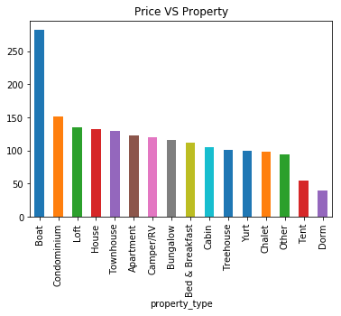
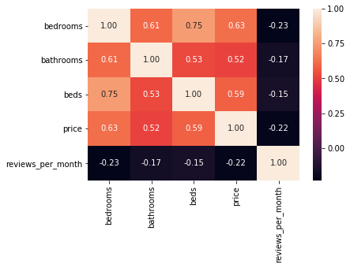
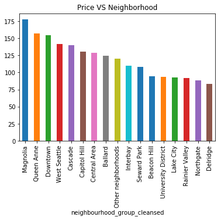

# Boston Air BnB Analysis
## 1. Data exploration

This is a blog post to review and discuss Airbnb stayings in Boston with aspects and key values that could help you choose one staying over the other 

I took some public data from Airbnb site and started my analysis and breakdown. below are some demonstartions that was concluded after analysis 

## Question 1 What is the most expensive property type ?

here we can find that Boats are that most expensive property over all other types folled with Condominuin, While dorm is the cheapest.

## Question 2 What is the most expensive property type?

## Question 3 What is the most expensive property type?

